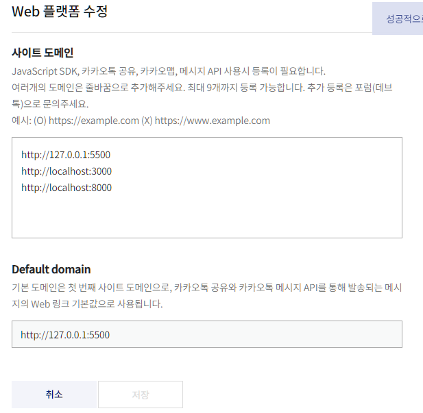
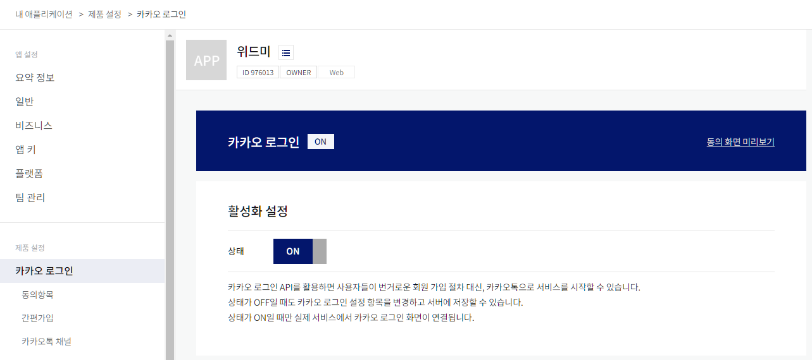
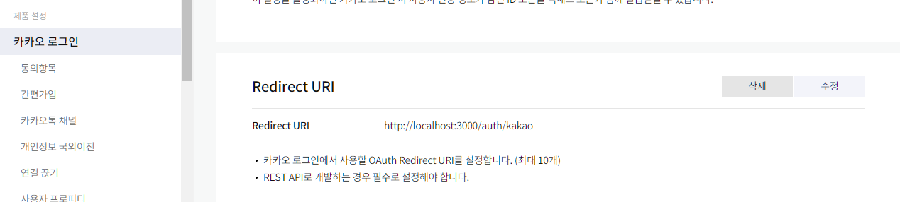
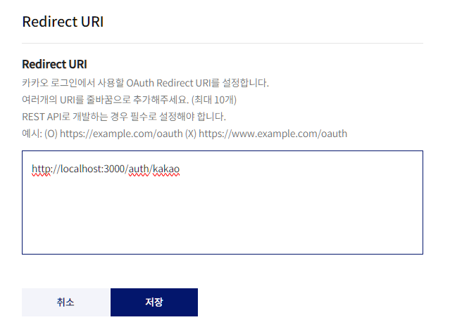
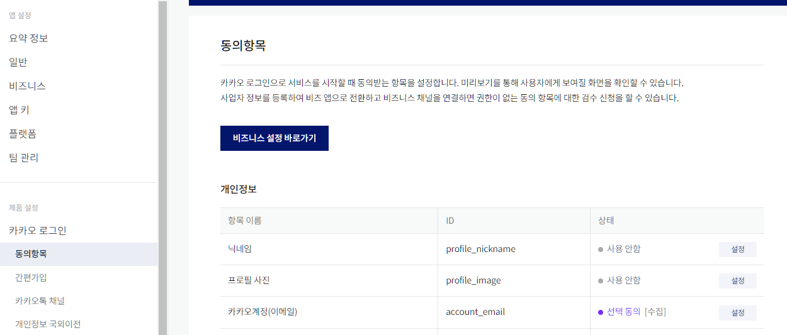
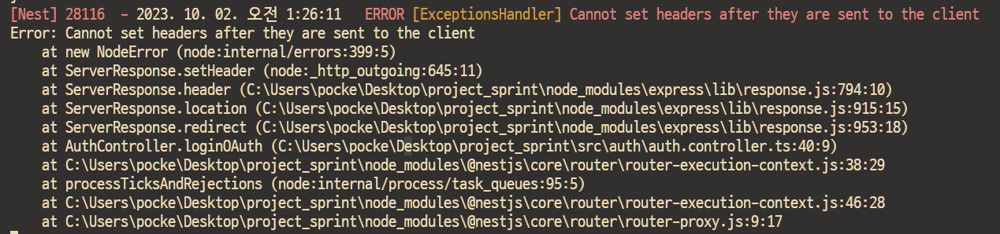

# 작업 순서

## 기본 설정

### 1. git 컨벤션 설정

- `commitizen`과 `cz-customizable`패키지를 사용하여 커밋 컨벤션 제한
- 설치

```bash
$ yarn add -D commitizen cz-customizable
```

- `.cz-config.js` 파일 추가

```json
// package.json
{
  "scripts": {
    "commit": "cz"
  },
  "config": {
    "commitizen": {
      "path": "node_modules/cz-customizable",
      "maxLineWidth": 0
    }
  }
}
```

- `husky`의 `pre-push`를 사용하여 master branch로 바로 push 되는 것을 방지

```bash
$ npx husky-init && yarn
$ npx husky add .husky/pre-push '명령어'
```

- `.husky/pre-push` 파일 작성

​    

### 2. 환경변수 설정 추가

```bash
$ yarn add @nestjs/config
```

- app.module.ts 파일 수정


> ❗커밋 실수❗

- git rebase로 수정함

```bash
$ git rebase -i HEAD~돌아가고싶은커밋수
```

​    

### 3. prettier, eslint, vscode editor 설정

- `.vscode/settings.json` 설정
- `.prettierrc`, `.eslintrc.js` 파일 작성

```bash
$ yarn add -D eslint
$ yarn add -D prettier
```

​    

### 4. tsconfig.json에 경로설정

- 절대경로 지정

```json
// tsconfig.json
{
	"compilerOptions": {
		"paths": {
      		"..": ["./src/*"]
    	}
	}
}
```

​    

### 5. DB 연결

```bash
$ yarn add typeorm @nestjs/typeorm mysql2
$ nest g mo db
```

- db.modules.ts에 Typeorm 설정추가


>  ❗오류 발생 ❗

- 자동으로 코드 컨벤션 안바뀌는 오류
- 원인 : `.vscode/settings.json`에서 `setting.json`으로 오타냄

​     

### 6. typeorm migration 설정 추가

- `type-orm.config.ts` 작성
- `dotenv` 설치 필요

```bash
$ yarn add dotenv
```

- `package.json` `scripts` 추가

```json
{
    "scripts": {
    	"tom": "ts-node ./node_modules/typeorm/cli",
    	"tom:create": "npm run tom migration:create ./migrations/Mig",
    	"tom:gen": "npm run tom migration:generate ./migrations/Mig -- -d ./src/db/type-orm.config.ts",
    	"tom:up": "npm run tom migration:run -- -d ./src/db/type-orm.config.ts",
    	"tom:down": "npm run tom migration:revert -- -d ./src/db/type-orm.config.ts"
    }
}
```


> ❗오류발생❗

- TypeOrmModule.forRootAsync에서 logging과 synchronize가 비정상적으로 동작
- 원인 : 해당 옵션에는 boolean값이 필요한데 환경변수에서 string 값을 받아서 무조건 true가 됨
- 해결 : 삼항연산자로 string값이 같으면 true, 아니면 false로 설정되도록 바꿈

```ts
@Module({
  imports: [
    TypeOrmModule.forRootAsync({
      useFactory: (config: ConfigService) => ({
        synchronize: config.getOrThrow('DB_SYNC') === 'true' ? true : false,
        logging: config.getOrThrow('DB_LOG') === 'true' ? true : false,
      }),
      inject: [ConfigService],
    }),
  ],
})
```

- 더 찾아보니 환경변수를 숫자 (`0`, `1`)를 준 후 옵션에서는 `Boolean()` 생성자 함수로 감쌈

```ts
synchronize: Boolean(process.env.DB_LOG),
```

​    

### 7. 도커 개발환경 구축

- `Dockerfile`
  - 백엔드 코드 빌드
- `docker-compose.yaml`
  - 백엔드 코드
  - mysql
  - redis
- `.dockerignore`


---


## 코드 구현

### UsersModule

```bash
$ nest g res users --no-spec
```

1. Entity 작성

   - `User` 
   - `Profile`
   - `Job`
   - `DevCareer`

2. DTO 작성

   - `class-validator`, `class-transformer` 설치

   ```bash
   $ yarn add class-validator class-transformer
   ```

3. 유저 CRUD 작성

``` bash
$ yarn add bcrypt
$ yarn add -D @types/bcrypt
```

```bash
$ yarn add uuid
$ yarn add -D @types/uuid
```

- 구현한 API
  1. 회원가입
  2. 로그인한 유저정보 불러오기
  3. 프로필 업데이트
  4. 회원탈퇴
  5. 비밀번호 확인
  6. 임시비밀번호 발급
  7. 비밀번호 리셋
  8. [관리자] 단일 유저정보 불러오기
  9. [관리자] 모든 유저정보 불러오기
- 유저 repository relations enum 파일작성
- 

!! 비밀번호 처리를 어디서 할 건가?


- devCareer와 job은 Category라는 하나의 모듈로 빼기로 결정


### AuthModule

```bash
$ nest g res auth --no-spec
```

- 세션방식 로그인 구현

```bash
$ yarn add @nestjs/passport passport passport-local express-session
$ yarn add -D @types/passport-local @types/express-session
```


- connect-redis 설치

```bash
$ yarn add connect-redis ioredis
```

- 인메모리 저장소 변경을 위해 사용
- v6 에서 v7되면서 문법이 많이 바뀜

https://techbless.github.io/2023/04/01/express-session%EC%97%90%EC%84%9C-redis%EC%82%AC%EC%9A%A9%EC%9D%84-%EC%9C%84%ED%95%9C-connect-redis-v7-%EB%B3%80%EA%B2%BD-%EC%82%AC%ED%95%AD/


❗오류발생❗

- connect-redis패키지에서 오류 발생
- 원인 : @types 패키지가 deprecated 되었는데 같이 설치되어있어서 이상한 type이 적용되어서 오류가 발생했던 것
- 해결 : @type 패키지 삭제하고 node_modules 재설치

❗오류발생❗

- 세션 ID 저장 안되는 오류
- 원인 : session cookie 설정중에 `httpOnly`와 `secure` 옵션을 `true`로 지정하여 https 환경에서만 활용가능하게 설정되어 있었음


- 세션 로그인을 위한 설정
- guard 파일 생성
  - `authenticated.guard.ts`
  - `login-auth.guard.ts`
- serializer 파일 생성
  - `session.serializer.ts`
- strategy 파일 생성
  - `local.strategy.ts`


- 유저 커스텀 데코레이터 생성
- public 커스텀 데코레이터 생성
- 모든 controller에 `authenticated` 가드 설정
- 소셜로그인 구현

```bash
# 카카오 로그인
$ yarn add passport-kakao
$ yarn add -D @types/passport-kakao
```

- 프론트코드

```html
<a href="백엔드소셜로그인API">카카오로그인</a>
```

- 카카오 개발자 사이트 설정
- 프론트엔드 도메인 입력



- 카카오 로그인 활성화



- redirect URI 등록 (백엔드 API)





- 동의항목 설정




!! 오류발생

- 백엔드에서 redirect시에 생긴 오류



❗❗ 배포해서 확인해봐야할듯

```typescript
// controller 
@UseGuards(SocialAuthGuard)
@Get(':social')
loginOAuth(@UserData() user: User, @Res() res: Response) {
	return this.authService.loginOAuth(user, res);
}

// service
loginOAuth(user: User, res: Response) {
	res.redirect('https://yoonsik.shop');
	return user;
}
```


​    

!! 오류발생

- `@Redirect` 데코레이터의 인수로 `process.env`와 `configService.get` 모두 적용안됨
- 임시로 하드 코딩 해놓음

   

### StudyModule

```bash
$ nest g res study --no-spec
```

1. Entity 작성
   - `Study`
   - `Recruit`
   - `Inquiry`
